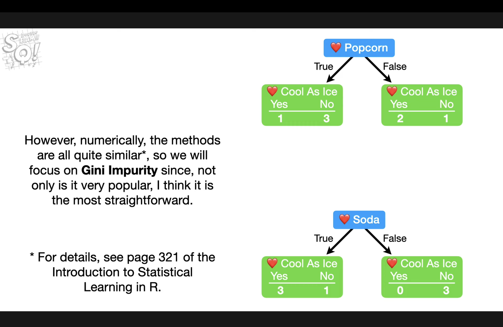
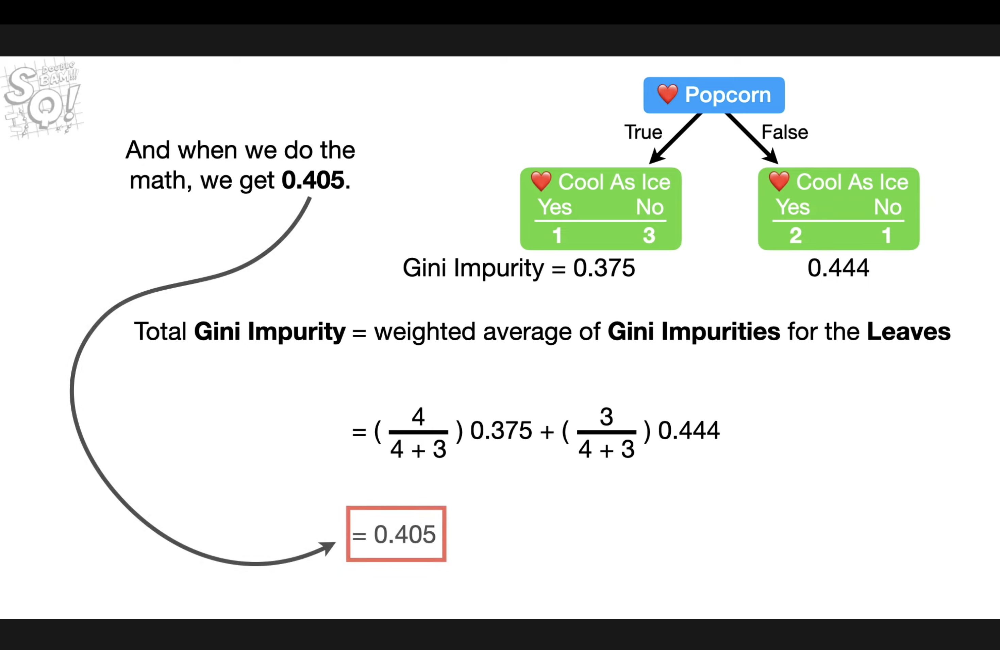
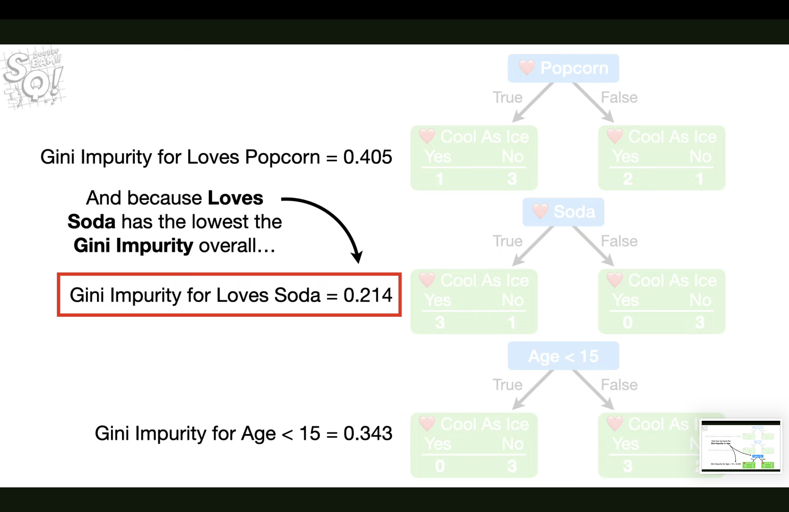
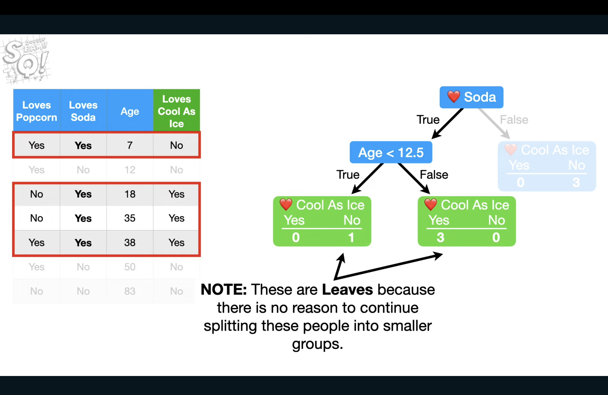
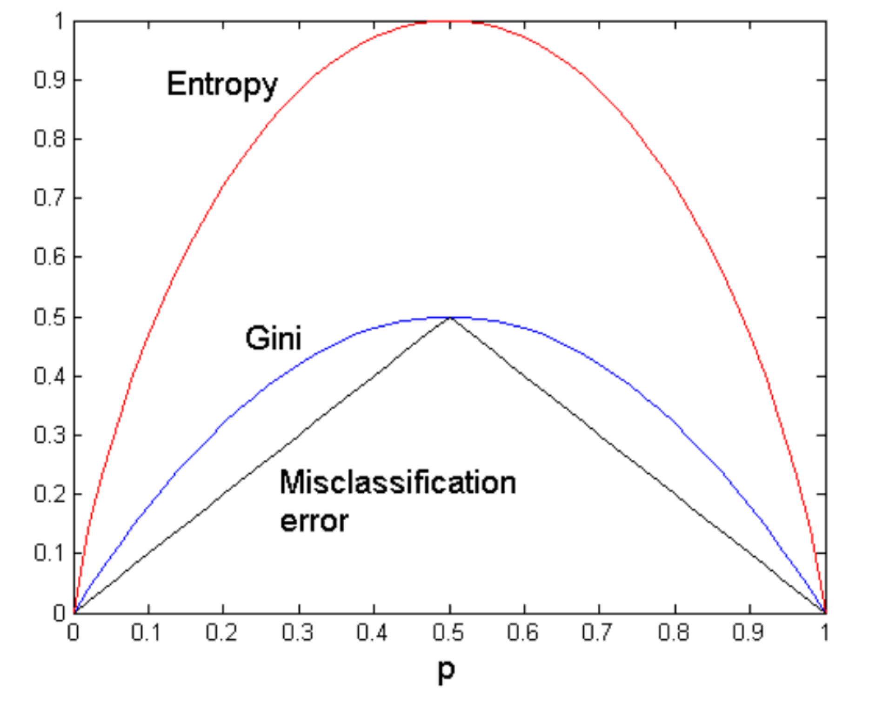
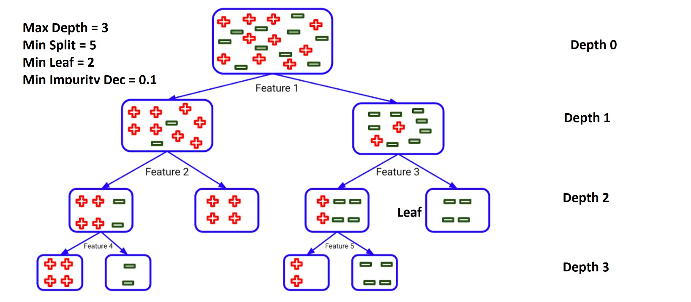
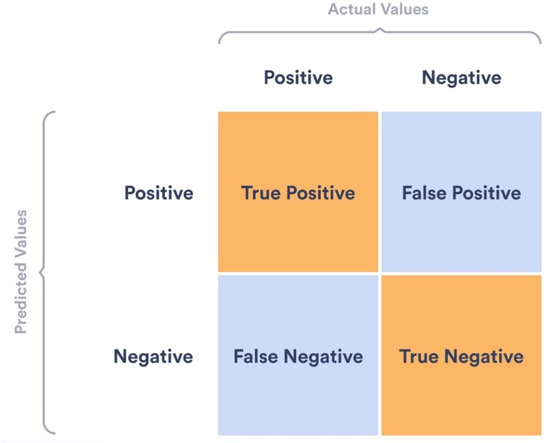

# INFO6105DataScienceEngineeringMethodsandTools

## Table of Contents

1. [Introduction to Data Science](#1-Introduction-to-Data-Science)
- [Supervised Approaches](#Supervised-Approaches)
- [Training Model](#Training-Model)
- [Train / Test/ Validation](#Train-Test-Validation)
- [Unsupervised Approaches](#Unsupervised-Approaches)
- [Loss Function in Unsupervised](#Loss-Function-in-Unsupervised)

2. [Data Preprocessing](#2-Data-Preprocessing)
- [Why Data Preprocessing](#Why-Data-Preprocessing)
- [Multiple Imputation by Chained Equation(MICE)](#Multiple-Imputation-by-Chained-Equations)
- [Binning](#Binning)

3. [Decision Trees](#3-Decision-Trees)
- [Create a Decision Tree](#Create-a-Decision-Tree)
- [Gini](#Gini)
- [Gain](#Gain)
- [Classification Error](#Classification-Error)
- [Entropy](#Entropy)
- [Information Gain](#Information-Gain)
- [Gain Ratio](#Gain-Ratio)
- [Code for Decision Trees](#Code-for-Decision-Trees)
- [Confusion Matrix](#Confusion-Matrix)

4. [Clustering Methods](#4-Clustering-Methods)

5. [Linear Regression](#5-Linear-Regression)
- [Code for Linear Regression](#Code-for-Linear-Regression)
- [Code for KNN](#Code-for-KNN)

6. [Association Rules](#6-Association-Rules)
- [Code for Association rules](#Code-for-Association-rules)

7. [Ensembles and Supervised learners](#7-Ensembles-and-Supervised-learners)
- [Random Forest](#Random-Forest)
- [Adaboost](#Adaboost)
- [Code for Random Forests and Adaboost](#Code-for-Random-Forests-and-Adaboost)

7. [Non-Linear Classifiers](#5-Non-Linear-Classifiers)

8. [Ensembles and Super learners](#6-Ensembles-and-Super-learners)

9. [Dimensionality Reduction](#7-Dimensionality-Reduction)

10. [Introduction to Neural Networks / Deep Learning](#10-Introduction-to-Neural-Networks-and-Deep-Learning)
- [Create a Decision Tree](#Create-a-Decision-Tree)
- [Gini](#Gini)

11. [Introduction to Big-data Analysis](#11-Introduction-to-Big-data-Analysis)

## 1. Introduction to Data Science
### Supervised Approaches
**Regression:** Learn a line/curve (the model) using training data consisting of Input-output pairs. Use it to predict the outputs for new inputs<br>
SVM(Support Vector Machines): Support Vector Machine (SVM) models have the ability to perform a non-linear regression / classification by mapping their inputs into high-dimensional feature spaces<br>

**Classification:** Learn to separate different classes (the model) using training data consisting of input-output pairs Use it to identify the labels for new inputs<br>
Ensembles: Ensemble methods are machine learning techniques that combines several models in order to produce optimal models<br>

### Training Model
Our training data comes in pairs of inputs (x,y)<br>
D={(x1,y1),...,(xn,yn)}<br>

xi: input vector of the ith sample (feature vector)<br>
yi: label of the ith sample Training dataset<br>
D: Training dataset

The goal of supervised learning is to develop a model h:<br>
h(xi)≈yi for all (xi,yi)∈D<br>

### Train, Test, Validation
**Training Set:** The model learns patterns and relationships within the training set. It is the data on which the model is trained to make predictions.<br>

**Testing Set:** Once the model is trained, it is evaluated on the testing set to assess its performance and generalization to new, unseen data. This set helps to estimate how well the model is likely to perform on new, real-world data.<br>

**Validation Set:** The validation set is another independent subset used during the training phase to fine-tune the model and avoid overfitting.<br>

**Best practice:**<br>
Train : 70%-80%<br>
Validation : 5%-10%<br>
Test: 10%-25%<br>

### Unsupervised Approaches
**Clustering:** Learn the grouping structure for a given set of unlabeled inputs<br>
**Association rule:** Association rule mining is a rule- based machine learning method for discovering interesting relations between variables in transactional databases.<br>
Example: basket analysis, where the goal is to uncover associations between items frequently purchased together.<br>

**Apriori Algorithm:** The Apriori algorithm is a widely used algorithm for mining association rules. It works by iteratively discovering frequent itemsets (sets of items that occur together frequently) and generating association rules based on these itemsets.<br>

Rule: X => Y<br>
X: antecedent (or left-hand side) items that when observed<br>
Y: consequent (or right-hand side) items that are expected or likely to be present when the conditions in the antecedent are mets<br>

A, B => C: it suggests that when both items A and B are present (antecedent), there is a likelihood that item C will also be present (consequent).<br>
{Milk, Bread} => {Eggs}: customers who buy both milk and bread are likely to buy eggs as well.<br>

**Support:** Support measures the frequency of occurrence of a particular combination of items in a dataset. High support values indicate that the itemset is common in the dataset.<br>

Support = frq(X,Y)/N<br>
frq(X, Y): This is the count of transactions where the itemset (X, Y) is present.<br>
N: This represents the total number of transactions or instances in the dataset.<br>
Support({Milk,Bread})= Number of transactions containing both Milk and Bread/Total number of transactions in the dataset<br>

**Confidence:** Confidence measures the likelihood that an associated rule holds true. It is the conditional probability of finding the consequent (item B) given the antecedent (item A). High confidence indicates a strong association between the antecedent and consequent.<br>

Confidence = frq(X,Y)/frq(X)<br>
frq(X, Y): This is the count of transactions where both the antecedent (X) and the consequent (Y) are present.<br>
frq(X): This is the count of transactions where the antecedent (X) is present.<br>
Confidence({Milk, Bread}⇒{Eggs}) = Number of transactions containing Milk, Bread, and Eggs/Number of transactions containing Milk and Bread<br>

**Lift:** Lift measures the strength of association between an antecedent and consequent, taking into account the support of both itemsets. A lift greater than 1 indicates that the presence of the antecedent increases the likelihood of the consequent.<br>

Lift = Support(X,Y)/[Support(X)*Support(Y)]<br>
Support(X, Y): This is the support of the itemset containing both X and Y<br>
Support(X): This is the support of the antecedent X<br>
Support(Y): This is the support of the consequent Y<br>

The lift formula essentially compares the observed co-occurrence of X and Y (Support(X, Y)) to what would be expected if X and Y were independent events (Support(X) * Support(Y))<br>
Lift = 1: X and Y are independent.<br>
Lift > 1: There is a positive association between X and Y (X and Y are more likely to occur together than expected).<br>
Lift < 1: There is a negative association between X and Y (X and Y are less likely to occur together than expected).<br>

Lift({Milk, Bread}⇒{Eggs})= Support({Milk, Bread, Eggs})/Support({Milk, Bread})×Support({Eggs})<br>

### Loss Function in Unsupervised
Unsupervised learning is about modeling the world<br>
**K-Means Clustering:** In k-means clustering, the goal is to partition a dataset into k clusters, where each data point belongs to the cluster with the nearest centroid.<br>
**Loss Function:** The loss function in k-means is typically the sum of squared distances between each data point and its assigned cluster centroid. The objective is to minimize this sum.<br>

Loss = ∑ N i=1 (xi - cji)^2<br>
MSE(Mean Squared Error) Loss = 1/N * Loss<br>
N: the number of data points<br>
xi: a data point<br>
cji: centroid of the cluster to which xi is assigned<br>

## 2. Data Preprocessing
### Why Data Preprocessing
- Incomplete: e.g., occupation=“ ”<br>
- Noisy: e.g., Salary=“-10”<br>
- Inconsistent: e.g., Age=“42” Birthday=“03/07/1997”<br>

**Data Cleaning**<br>
- Fill in missing values
- Smooth noisy data
- Identify or remove outliers
- Remove duplicates
- Resolve inconsistencies and discrepancies

**Data Transformation**<br>
- Normalization 
- Discretization

**Data Reduction**<br>
- Dimensionality reduction
- Numerosity reduction

**Data Integration**<br>
- Combining data from multiple sources into a unified dataset.

### Multiple Imputation by Chained Equations

**Chained:** Implies a sequential process where each variable with missing data is imputed one at a time, iterating through each variable in a cycle.<br>

**Equations:** For each variable being imputed, a separate imputation model is fit. The type of model depends on the nature of the variable (e.g., logistic regression for binary variables, linear regression for continuous variables, etc.).<br>

**Univariate Imputation**<br>
In univariate imputation, each missing value in a dataset is imputed (filled in) based on information from the same variable.<br>

- Mean/Median/Mode Imputation: Missing values are replaced with the mean, median, or mode of the observed values in the same variable. This is simple and often effective but can distort the distribution of the data and underestimate the variability.<br>
- Random Sampling: Missing values are replaced with a value drawn randomly from the observed values of the same variable. This maintains the distribution but doesn't use any other information that might be helpful.<br>
- Constant Value: All missing values are filled in with a constant value, such as zero. This is a basic approach and is rarely used unless there is a strong justification.<br>

Example:<br>
| Student | Age | Test Score |
|---------|-----|------------|
| A       | 14  | 85         |
| B       | 13  | Missing    |
| C       | 14  | 90         |
| D       | 13  | 75         |
| E       | 14  | Missing    |

Mean Test Score = (85 + 90 + 75) / 3 = 83.33<br>

| Student | Age | Test Score |
|---------|-----|------------|
| A       | 14  | 85         |
| B       | 13  | 83.33      |
| C       | 14  | 90         |
| D       | 13  | 75         |
| E       | 14  | 83.33      |

**Multivariate Imputation**<br>
Multivariate imputation considers the relationships between different variables in the dataset when imputing missing values.<br>

- Multiple Imputation: It involves creating multiple complete datasets by imputing the missing values multiple times. Statistical models (like regression models) are used, considering the relationships among the variables. The results from these multiple datasets are then combined to give a final estimate. This method is useful as it also estimates the uncertainty due to missing data.<br>

| Age | Experience | Salary |
|-----|------------|--------|
| 25  |            | 50     |
| 27  | 3          |        |
| 29  | 5          | 110    |
| 31  | 7          | 140    |
| 33  | 9          | 170    |
|     | 11         | 200    |

Step 1: Impute all missing values with the mean<br>
29 = (25+27+29+31+33)/5<br>
7 = (3+5+7+9+11)/5<br>
134 = (50+110+140+170+200)/5<br>
| Age | Experience | Salary |
|-----|------------|--------|
| 25  | 7          | 50     |
| 27  | 3          | 134    |
| 29  | 5          | 110    |
| 31  | 7          | 140    |
| 33  | 9          | 170    |
| 29  | 11         | 200    |

Step 2: Romve the 'Age' inputed value<br>

Step 3: Use LinearRegression to estimate the missing age, the predicted age is 36.2532<br>
```
# LinearRegression
from sklearn.linear_model import LinearRegression
import numpy as np

# Example data
X = np.array([[7, 50], [3, 134], [5, 110], [7, 140], [9, 170]])  # Experience and Salary
y = np.array([25, 27, 29, 31, 33])  # Age

# Create linear regression model
model = LinearRegression()
model.fit(X, y)

# Predict the missing age
predicted_age = model.predict([[11, 200]])  # Experience = 11, Salary = 200
print("Predicted Age:", predicted_age[0])
# Predicted Age: 36.25316455696203
```
| Age | Experience | Salary |
|-----|------------|--------|
| 25  | 7          | 50     |
| 27  | 3          | 134    |
| 29  | 5          | 110    |
| 31  | 7          | 140    |
| 33  | 9          | 170    |
| 36.2532  | 11    | 200    |

Step 4: Romve the 'Experience' inputed value, and use LinearRegression to estimate the missing age, the predicted Experience is 1.8538<br>

Step 5: Romve the 'Salary' inputed value, and use LinearRegression to estimate the missing age, the predicted Experience is 72.7748, iteration 1 done<br>
| Age | Experience | Salary |
|-----|------------|--------|
| 25  | 1.8538     | 50     |
| 27  | 3          | 72.7748|
| 29  | 5          | 110    |
| 31  | 7          | 140    |
| 33  | 9          | 170    |
| 36.2532  | 11    | 200    |

Step 6: 
| Age | Experience | Salary |     | Age | Experience | Salary |     | Age | Experience | Salary  |
|-----|------------|--------|-----|-----|------------|--------|-----|-----|------------|---------|
| 25  | 1.8538     | 50     |     | 25  | 7          | 50     |     | 0   | -5.1462    | 0       |
| 27  | 3          | 72.7748|     | 27  | 3          | 134    |     | 0   | 0          | -61.2252|
| 29  | 5          | 110    |  -  | 29  | 5          | 110    |  =  | 0   | 0          | 0       |
| 31  | 7          | 140    |     | 31  | 7          | 140    |     | 0   | 0          | 0       |
| 33  | 9          | 170    |     | 33  | 9          | 170    |     | 0   | 0          | 0       |
| 36.2532  | 11    | 200    |     | 29  | 11         | 200    |     | 7.2532  | 0      | 0       |

iteration 2:
| Age | Experience | Salary |     | Age | Experience | Salary |     | Age | Experience | Salary  |
|-----|------------|--------|-----|-----|------------|--------|-----|-----|------------|---------|
| 25  | 1.8538     | 50     |     | 25  | 0.9172     | 50     |     | 0   | 0.9366     | 0       |
| 27  | 3          | 72.7748|     | 27  | 3          | 80.7385|     | 0   | 0          | 7.9637  |
| 29  | 5          | 110    |  -  | 29  | 5          | 110    |  =  | 0   | 0          | 0       |
| 31  | 7          | 140    |     | 31  | 7          | 140    |     | 0   | 0          | 0       |
| 33  | 9          | 170    |     | 33  | 9          | 170    |     | 0   | 0          | 0       |
| 36.2532  | 11    | 200    |     | 34.8732  | 11    | 200    |     | 1.38| 0          | 0       |
```
# LinearRegression
from sklearn.linear_model import LinearRegression
import numpy as np

# Example data
X = np.array([[1.8538, 50], [3, 72.7748], [5, 110], [7, 140], [9, 170]])  # Experience and Salary
y = np.array([25, 27, 29, 31, 33])  # Age

# Create linear regression model
model = LinearRegression()
model.fit(X, y)

# Predict the missing age
predicted_age = model.predict([[11, 200]])  # Experience = 11, Salary = 200
print("Predicted Age:", predicted_age[0])
# Predicted Age: 34.87326219387428
```

iteration 3:<br>
...<br>

iteration 4:<br>
...<br>

```
# MICE Imputation
import pandas as pd
from sklearn.experimental import enable_iterative_imputer
from sklearn.impute import IterativeImputer

# Read data
input_dataframe = pd.read_csv("/Users/zhangxijing/MasterNEU/INFO6105DataScienceEngineeringMethodsandTools/Dataset/Microbiology_Dataset.csv")
print(input_dataframe)

# MICE
imputer = IterativeImputer(max_iter=10, random_state=0) # Imputer Initialization
imputed_dataset = imputer.fit_transform(input_dataframe) # Perform imputation
imputed_dataframe = pd.DataFrame(imputed_dataset, columns=input_dataframe.columns) # Converts the numpy array into pandas DataFrame
print(imputed_dataframe)
```

### Binning
**Equal-Width Binning:**<br> Divides the data range into equal-width intervals. For example, grouping ages into bins like 0-10, 11-20, 21-30, etc.<br>

**Equal-Frequency Binning:**<br> Divides the data into intervals containing approximately the same number of data points. This method can be more robust to data distribution variations.<br>

**Robustness:**<br> In statistical and mathematical contexts, a robust statistic or method is one that is not heavily influenced by outliers or extreme values. It can provide reliable results even when the data deviates from the expected distribution or contains anomalies.<br>

```
# Binning
imputed_dataframe['MIC_bin'] = pd.qcut(imputed_dataframe['MIC'], q=3) # Divides the data into 3 quantile-based bins
imputed_dataframe['MIC'] = pd.Series ([interval.mid for interval in imputed_dataframe['MIC_bin']]) # Extracting Midpoints of Bins
print(imputed_dataframe)

#       Original Data Binned Category  Midpoints
# 0           128.000    (1.0, 256.0]   128.5000
# 1             0.125  (0.001, 0.125]     0.0630
# 2             0.064  (0.001, 0.125]     0.0630
# 3             1.000    (0.125, 1.0]     0.5625
# 4             3.000    (1.0, 256.0]   128.5000
# ...             ...             ...        ...
# 1717          0.190    (0.125, 1.0]     0.5625
# 1718          0.190    (0.125, 1.0]     0.5625
# 1719          0.190    (0.125, 1.0]     0.5625
# 1720          0.750    (0.125, 1.0]     0.5625
# 1721          0.190    (0.125, 1.0]     0.5625
# [1722 rows x 3 columns]
```

```
# Binning
# Your data
data = np.array([2, 2, 2, 4, 4, 3, 1, 4, 2, 1, 3, 4, 1, 1, 4, 7, 4, 1, 1, 2, 4, 3, 4, 3, 3, 2, 5, 2, 3, 2, 3, 4, 2, 10, 4, 4, 6, 3, 3, 1, 1, 2, 1, 3, 2, 4, 5, 2, 4, 3, 2, 3, 4, 3, 1, 1, 6, 3, 6, 5, 7, 2, 1, 1, 6, 5, 1, 1, 1, 2, 2, 1, 2, 2, 4, 4, 1, 5, 7, 2, 1, 2, 1, 5, 3, 1, 1, 2, 3, 3, 5, 4, 4, 6, 1, 4, 4, 1, 3, 4, 4, 5, 4, 4, 1, 1, 3, 1, 2, 1, 3, 7, 2, 1, 1, 3, 3, 6, 1, 6, 2, 3, 7, 1])

# Perform quantile-based binning
bins = pd.qcut(data, q=3)

# Create a Pandas Series with the midpoints of the bins
midpoints_series = pd.Series([interval.mid for interval in bins])

# Create a DataFrame to visualize the original data, binned categories, and midpoints
df = pd.DataFrame({'Original Data': data, 'Binned Category': bins, 'Midpoints': midpoints_series})

# Display the DataFrame
print(df)

#      Original Data Binned Category  Midpoints
# 0                2    (0.999, 2.0]     1.4995
# 1                2    (0.999, 2.0]     1.4995
# 2                2    (0.999, 2.0]     1.4995
# 3                4      (2.0, 4.0]     3.0000
# 4                4      (2.0, 4.0]     3.0000
# ..             ...             ...        ...
# 119              6     (4.0, 10.0]     7.0000
# 120              2    (0.999, 2.0]     1.4995
# 121              3      (2.0, 4.0]     3.0000
# 122              7     (4.0, 10.0]     7.0000
# 123              1    (0.999, 2.0]     1.4995
# [124 rows x 3 columns]
```

## 3. Decision Trees

- A decision tree is a hierarchical classification model that uses a tree structure and can be used to support decisions<br>
- Each internal node represents a test on one attribute (feature)<br>
- Each branch from a node represents a possible outcome of the test<br>
- Each leaf node represents a class label<br>

- When a Decision Tree classifies things into categories. it's called a Classification Tree.<br>
- When a Decision Tree predicts numeric values. it's called a Regression Tree.<br>

### Create a Decision Tree
| Loves Popcorn | Loves Soda    | Age           | Loves Cool As Ice |
|---------------|---------------|---------------|-------------------|
| Yes           | Yes           | 7             | No                |
| Yes           | No            | 12            | No                |
| No            | Yes           | 12            | Yes               |
| No            | Yes           | 12            | Yes               |
| Yes           | Yes           | 12            | Yes               |
| Yes           | No            | 12            | No                |
| No            | No            | 12            | No                |

|                                       |                                       |
| ------------------------------------- | ------------------------------------- |
|  |  |
#### Step1: Calculate Gini Impurity for Loves Popcorn
Loves Popcorn(True) -> 1 Loves Cool As Ice(Ture) and 3 Loves Cool As Ice(False)<br>
Loves Popcorn(False) -> 2 Loves Cool As Ice(Ture) and 1 Loves Cool As Ice(False)<br>

Gini Impurity for a Leaf = 1 - (1/4)^2 - (3/4)^2 = 0.375<br>
Gini Impurity for a Leaf = 1 - (2/3)^2 - (1/3)^2 = 0.444<br>
Total Impurity for Loves Popcorn = 0.375*(4/7) + 0.444*(3/7) = 0.405<br>

#### Step2: Calculate Gini Impurity for Loves Soda
Loves Soda(True) -> 3 Loves Cool As Ice(Ture) and 1 Loves Cool As Ice(False)<br>
Loves Soda(False) -> 0 Loves Cool As Ice(Ture) and 3 Loves Cool As Ice(False)<br>

Likewise Total Impurity for Loves Soda = 0.214<br>
Loves Soda does a better job predicting who will and will not Loves Cool As Ice<br>

#### Step3: Calculate Gini Impurity for Age
Calculate Gini Impurity for 9.5, 15, 26.5, 36.5, 44, 66.5<br>

Age < 9.5(True) -> 0 Loves Cool As Ice(Ture) and 1 Loves Cool As Ice(False)<br>
Age < 9.5(False) -> 3 Loves Cool As Ice(Ture) and 3 Loves Cool As Ice(False)<br>
Gini Impurity for a Leaf = 1 - (0/1)^2 - (1/1)^2 = 0<br>
Gini Impurity for a Leaf = 1 - (3/6)^2 - 3(/6)^2 = 0.5<br>
Total Gini Impurity for Age 9.5 = 0*(1/7) + 0.5*(6/7) = 0.429<br>

Likewise<br>
Total Gini Impurity for Age 9.5 = 0.429<br>
Total Gini Impurity for Age 15 = 0.343<br>
Total Gini Impurity for Age 26.5 = 0.476<br>
Total Gini Impurity for Age 36.5 = 0.476<br>
Total Gini Impurity for Age 44 = 0.343<br>
Total Gini Impurity for Age 66.5 = 0.429<br>
Two candidate thresholds 15 and 44 has lowest Impurity, so we can pick one, we pick 15 here<br>

#### Step4: Compare Gini Impurity
Gini Impurity for Loves Soda = 0.214<br>
Gini Impurity for Age < 15 = 0.343<br>
Gini Impurity for Loves Popcorn = 0.405<br>
So we put Loves Soda at the top of the tree<br>
|                                       |                                       |
| ------------------------------------- | ------------------------------------- |
|  |  |

### Gini
Gini = 1 − ∑i=1 n pi^2<br>
​pi: the proportion of items labeled with class i in the set<br>

|                 | Parent          |
| --------------- | --------------- |
| C1              | 6               |
| C2              | 6               |

Gini = 1-(6/12)^2-(6/12)^2 = 0.5<br>

|                 | N1              | N2              |
| --------------- | --------------- | --------------- |
| C1              | 5               | 2               |
| C2              | 1               | 4               |

Gini(N1) = 1-(5/6)^2-(1/6)^2 = 0.278<br>
Gini(N2) = 1-(2/6)^2-(4/6)^2 = 0.444<br>
Gini(Children) = 6/12 * 0.278 + 6/12 * 0.444 = 0.361<br>
Gain = 0.500 – 0.361 = 0.139<br>

### Gain
Gain = P – M<br>
P: Impurity before spilt<br>
M: Impurity after spilt<br>
Gain = 0.500 – 0.361 = 0.139<br>

### Classification Error
Classification Error = 1−pMax<br>
pMax: proportion of the most common class in the node<br>

- Maximum (1 - 1/Number_of_classes) when records are equally distributed among all classes, implying least interesting information<br>
- Minimum (0) when all records belong to one class, implying most interesting information<br>

|                 |                 |
| --------------- | --------------- |
| C1              | 0               |
| C2              | 6               |

P(C1) = 0/6 = 0<br>
P(C2) = 6/6 = 1<br>
Classification Error = 1 - max(0, 1) = 1 - 1 = 0<br>

|                 |                 |
| --------------- | --------------- |
| C1              | 2               |
| C2              | 4               |

P(C1) = 2/6<br>
P(C2) = 4/6<br>
Classification Error = 1 - max(2/6, 4/6) = 1 - 4/6 = 1/3<br>

### Entropy
Entropy = − ∑j pi*log2(pi)<br>
j: number of classes<br>
pi: proportion of instances belonging to class pi in the dataset<br>

– Maximum (Log Number_of_classes) when records are equally distributed among all classes implying least information<br>
– Minimum (0.0) when all records belong to one class, implying most information<br>

|                 |                 |
| --------------- | --------------- |
| C1              | 0               |
| C2              | 6               |

P(C1) = 0/6 = 0<br>
P(C2) = 6/6 = 1<br>
Entropy = - 0*log0 - 1*log1 = 0<br>

|                 |                 |
| --------------- | --------------- |
| C1              | 2               |
| C2              | 4               |

P(C1) = 2/6<br>
P(C2) = 4/6<br>
Entropy = - (2/6)*log2(2/6) - (4/6)*log2(4/6) = 0.92<br>

**Comparing Impurity Measures**<br>
|                 |                 |
| --------------- | --------------- |
| Entropy and Gini are more sensitive to changes in the node probabilities than the misclassification error rate |  |

### Information Gain
Information Gain = Entropy(p) - (∑i=1 k ni/n*Entropy(i))<br>
ni: number of records in partition i<br>

Information gain has the disadvantage that it prefers attributes with large number of values that split the data into small, pure subsets leads to overfitting to train dataset.<br>

### Gain Ratio
Gain Ratio(Quinlan’s Gain Ratio)
– Adjusts Information Gain by the entropy of the partitioning (SplitINFO)<br>
– arge number of small partitions is penalized<br>
– Designed to overcome the disadvantage of Information Gain<br>
– Used in C4.5 algorithm<br>

### Code for Decision Trees
#### Stop Growth (Pre-pruning) techniques
Hyperparameters can be used as a constraint in decision trees:
– max_depth: maximum depth of decision tree.<br>
– min_sample_split: The minimum number of samples required to split an internal node.<br>
– min_samples_leaf: The minimum number of samples required to be at a leaf node.<br>
– min_impurity_decrease: The minimum decrease in impurity  by splitting.<br>


#### Post pruning techniques
– the technique adds complexity penalty to impurity.<br>
– It is parameterized by the cost complexity parameter, ccp_alpha.<br>
– Greater values of ccp_alpha increase the number of nodes pruned. When ccp_alpha is set to zero, the tree overfits.<br>

```
# Predict Resistance (as label) by Patient_Age, Bacteria, and Antimicrobial (as features)
# Decision Trees

#Input Dateset
org_df = pd.read_csv("/Users/zhangxijing/MasterNEU/INFO6105DataScienceEngineeringMethodsandTools/Dataset/DS_Dataset.csv")
clean_df = prepare_data(org_df) # Missing def prepare_data(org_df) here

#Define features to predict Resistance label
label_df = clean_df.loc[:,clean_df.columns == 'MIC_Interpretation_resistant']
feat_df = clean_df.loc[:,clean_df.columns != 'MIC_Interpretation_resistant']

#Seperate test and train data
train_feat, temp_feat, train_label, temp_label = train_test_split(feat_df, label_df, test_size=0.28, random_state=42)
test_feat, val_feat, test_label, val_label = train_test_split(temp_feat, temp_label, test_size=(20/28), random_state=42)

max_depth_thr = 30                     #Default max_depth threshold for Dtree (Default is 15)
min_samples_leaf_thr = 5              #Default min_samples_leaf threshold for Dtree (Default is 30)
min_impurity_thr = 0.001               #Default min_impurity threshold for Dtree (Default is 0.001)
ccp_thr = 0.0001                        #Default ccp_thr threshold for Dtree (Default is 0.0001)

#Create a model using Hyper-parameters
treemodel= tree.DecisionTreeClassifier(criterion="gini",
                                       min_impurity_decrease=min_impurity_thr,
                                       max_depth=max_depth_thr,
                                       min_samples_leaf=min_samples_leaf_thr,
                                       ccp_alpha=ccp_thr)
#Train the model
treemodel.fit(train_feat, train_label)
```

### Confusion Matrix
Accuracy = (True Positive + True Negative)/(True Positive + True Negative + False Positive + False Negative)<br>
Sensitivity = True Positive/(True Positive + False Negative)<br>
Specificity = True Negative/(True Negative + False Positive)<br>


## 4. Clustering Methods
- K-means clustering specifically tries to put the data into the number of clusters.<br>
- Hierarchical clustering tells you, pairwise, what two things are most similar.<br>

```
# Input Dateset
org_df = pd.read_csv("/Users/zhangxijing/MasterNEU/INFO6105DataScienceEngineeringMethodsandTools/Dataset/market_ds.csv")
train_feat = prepare_data(org_df)

# Get KMeans
inertias = []
for i in range(1, 11):  # Test 1 to 10 clusters
    kmeans = KMeans(n_clusters=i)
    kmeans.fit(train_feat)
    inertias.append(kmeans.inertia_)

# Kmeans
model = KMeans(n_clusters=2)
model.fit(train_feat)

# Filter rows based on cluster
first_cluster = train_feat.loc[model.labels_ == 0,:]
second_cluster = train_feat.loc[model.labels_ == 1,:]

# Agnes(Agglomerative Nesting)
linkage_data = linkage(train_feat, method='single', metric='euclidean')
dendrogram(linkage_data, truncate_mode = 'level' ,p=5)
plt.show()
```

## 5. Linear Regression
### Code for Linear Regression
```
#Input Dateset
org_df = pd.read_csv("/Users/zhangxijing/MasterNEU/INFO6105DataScienceEngineeringMethodsandTools/Dataset/hw4_train.csv")
test_df = pd.read_csv("/Users/zhangxijing/MasterNEU/INFO6105DataScienceEngineeringMethodsandTools/Dataset/hw4_test.csv")

#Define features and outcome for Regression
outcome_df =  org_df.loc[:,org_df.columns == 'BloodPressure']
feat_df =  org_df.loc[:,org_df.columns.isin(['Pregnancies','Glucose','SkinThickness','Insulin','BMI','DiabetesPedigreeFunction','Age','Outcome'])]

#Seperate test and train data
train_x,test_x,train_y,test_y = train_test_split(feat_df,outcome_df,test_size=0.25)

#Create a multiple Reg model
model = LinearRegression()
model.fit(train_x,  train_y)

test_pred_y = model.predict(test_x)

r_sq = model.score(test_x, test_y)
print ('R2 =',r_sq ) # statistical measure of how well the regression predictions approximate the real data points

# Predict 'BloodPressure' in hw4_test.csv
regression_features = test_df.columns.drop(['BloodPressure'])
X_test_reg = test_df[regression_features]
test_df['BloodPressure'] = model.predict(X_test_reg)
test_pred_y = model.predict(test_x)
print(test_df)
```
### Code for KNN
K Nearest Neighbor
```
# Load dataset
org_df = pd.read_csv("/Users/zhangxijing/MasterNEU/INFO6105DataScienceEngineeringMethodsandTools/Dataset/hw4_train.csv")

label_df =  org_df.loc[:,org_df.columns == 'Outcome']
feat_df =  org_df.loc[:,org_df.columns != 'Outcome']

# regression_features = test_df.columns.drop(['BloodPressure'])

# Separate test and train data
train_x, test_x, train_y, test_y = train_test_split(feat_df, label_df, test_size=0.25, random_state=42)

# Initialize lists to store the metrics
accuracies = []
sensitivities = []
specificities = []
k_values = range(1, 20)

# Train 19 KNN models with k from 1 to 19
for k in k_values:
    knn = KNeighborsClassifier(n_neighbors=k)
    knn.fit(train_x, train_y)
    test_pred_y = knn.predict(test_x)

    # Calculate confusion matrix and extract TP, TN, FP, FN
    cf = confusion_matrix(test_y, test_pred_y)
    TN, FP, FN, TP = cf.ravel()

    # Calculate accuracy, sensitivity (recall), and specificity
    accuracy = accuracy_score(test_y, test_pred_y)
    sensitivity = recall_score(test_y, test_pred_y)
    specificity = TN / (TN + FP)

    # Append metrics to their respective lists
    accuracies.append(accuracy)
    sensitivities.append(sensitivity)
    specificities.append(specificity)

# Identify the best k based on highest accuracy (or other criteria)
best_k_acc = k_values[accuracies.index(max(accuracies))]
print(f"Best k based on highest accuracy: {best_k_acc}")
print(f"Accuracy: {max(accuracies)}, Sensitivity: {sensitivities[accuracies.index(max(accuracies))]}, Specificity: {specificities[accuracies.index(max(accuracies))]}")
```

## 6. Association Rules
**Association rule:** Association rule mining is a rule- based machine learning method for discovering interesting relations between variables in transactional databases.<br>
Example: basket analysis, where the goal is to uncover associations between items frequently purchased together.<br>

Rule: X => Y<br>
X: antecedent (or left-hand side) items that when observed<br>
Y: consequent (or right-hand side) items that are expected or likely to be present when the conditions in the antecedent are mets<br>

A, B => C: it suggests that when both items A and B are present (antecedent), there is a likelihood that item C will also be present (consequent).<br>
{Milk, Bread} => {Eggs}: customers who buy both milk and bread are likely to buy eggs as well.<br>

**Support:** Support measures the frequency of occurrence of a particular combination of items in a dataset. High support values indicate that the itemset is common in the dataset.<br>

Support = frq(X,Y)/N<br>
frq(X, Y): This is the count of transactions where the itemset (X, Y) is present.<br>
N: This represents the total number of transactions or instances in the dataset.<br>
Support({Milk,Bread})= Number of transactions containing both Milk and Bread/Total number of transactions in the dataset<br>

**Confidence:** Confidence measures the likelihood that an associated rule holds true. It is the conditional probability of finding the consequent (item B) given the antecedent (item A). High confidence indicates a strong association between the antecedent and consequent.<br>

Confidence = frq(X,Y)/frq(X)<br>
frq(X, Y): This is the count of transactions where both the antecedent (X) and the consequent (Y) are present.<br>
frq(X): This is the count of transactions where the antecedent (X) is present.<br>
Confidence({Milk, Bread}⇒{Eggs}) = Number of transactions containing Milk, Bread, and Eggs/Number of transactions containing Milk and Bread<br>

**Lift:** Lift measures the strength of association between an antecedent and consequent, taking into account the support of both itemsets. A lift greater than 1 indicates that the presence of the antecedent increases the likelihood of the consequent.<br>

Lift = Support(X,Y)/[Support(X)*Support(Y)]<br>
Support(X, Y): This is the support of the itemset containing both X and Y<br>
Support(X): This is the support of the antecedent X<br>
Support(Y): This is the support of the consequent Y<br>

The lift formula essentially compares the observed co-occurrence of X and Y (Support(X, Y)) to what would be expected if X and Y were independent events (Support(X) * Support(Y))<br>
Lift = 1: X and Y are independent.<br>
Lift > 1: There is a positive association between X and Y (X and Y are more likely to occur together than expected).<br>
Lift < 1: There is a negative association between X and Y (X and Y are less likely to occur together than expected).<br>

Lift({Milk, Bread}⇒{Eggs})= Support({Milk, Bread, Eggs})/Support({Milk, Bread})×Support({Eggs})<br>

### Code for Association Rules
```
import pandas as pd
import matplotlib.pyplot as plt
from mlxtend.frequent_patterns import fpgrowth,apriori,association_rules


#Input Dateset
org_df = pd.read_csv("amr_horse_ds.csv")
org_df= pd.get_dummies(org_df.loc[:,org_df.columns!='Age'])

#Extract Association Rules
frequent_patterns_df = fpgrowth(org_df, min_support=0.1,use_colnames=True)
rules_df = association_rules(frequent_patterns_df, metric = "confidence", min_threshold = 0.9)
high_lift_rules_df = rules_df[rules_df['lift'] > 1.5]

#Save Association Rules
high_lift_rules_df.to_csv('arules.csv')

#Visualize Association Rules
fig = plt.figure()
ax = fig.add_subplot(projection='3d')
ax.scatter(rules_df['support'], rules_df['confidence'], rules_df['lift'], marker="*")
ax.set_xlabel('support')
ax.set_ylabel('confidence')
ax.set_zlabel('lift')
plt.show()
```

## 7. Ensembles and Supervised learners
### Random Forests


### Adaboost

### Code for Random Forests and Adaboost
```
import pandas as pd
from sklearn.model_selection import train_test_split, KFold, cross_val_score
from sklearn.ensemble import RandomForestClassifier, AdaBoostClassifier
from sklearn.metrics import accuracy_score

# Load Dataset
org_df = pd.read_csv("/Users/zhangxijing/MasterNEU/INFO6105DataScienceEngineeringMethodsandTools/Dataset/diabetes.csv")

# Define features and label
label_df = org_df['Outcome']
feat_df = org_df.drop('Outcome', axis=1)

# Initialize models with different estimators
rf_3 = RandomForestClassifier(n_estimators=3)
rf_50 = RandomForestClassifier(n_estimators=50)
ad_3 = AdaBoostClassifier(n_estimators=3)
ad_50 = AdaBoostClassifier(n_estimators=50)

# Setup K-Fold
k_folds = KFold(n_splits=5)

# Calculate cross-validation scores
scores_rf_3 = cross_val_score(rf_3, feat_df, label_df, cv=k_folds)
scores_rf_50 = cross_val_score(rf_50, feat_df, label_df, cv=k_folds)
scores_ad_3 = cross_val_score(ad_3, feat_df, label_df, cv=k_folds)
scores_ad_50 = cross_val_score(ad_50, feat_df, label_df, cv=k_folds)

# Print scores and their means
print(f"RF 3 Scores: {scores_rf_3}, Mean: {scores_rf_3.mean()}")
print(f"RF 50 Scores: {scores_rf_50}, Mean: {scores_rf_50.mean()}")
print(f"Adaboost 3 Scores: {scores_ad_3}, Mean: {scores_ad_3.mean()}")
print(f"Adaboost 50 Scores: {scores_ad_50}, Mean: {scores_ad_50.mean()}")
```

## 7. Non-Linear Classifiers
## 9. Dimensionality Reduction
## 10. Introduction to Neural Networks and Deep Learning


## 11. Introduction to Big-data Analysis